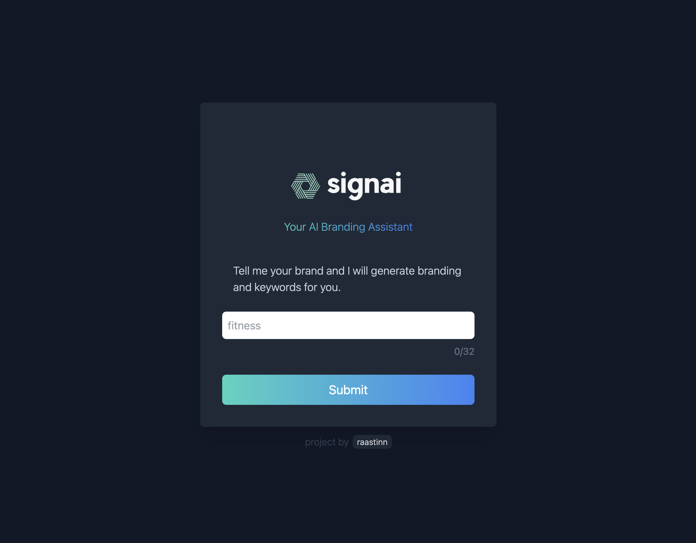

<!-- PROJECT LOGO -->
<br />
<p align="center">
  <a href="https://signai.vercel.app">
    
  </a>
  <h1 align="center">Your AI Branding Assistant</h1>

  <p align="center">
    An AI branding assistant to help you with your brand's marketing. Check it out at:
    <a href="https://signai.vercel.app">signai.vercel.app</a>
    <br />
    <br />
    <a href="https://rastin.dev">About Me</a>
  </p>
</p>

[](https://signai.vercel.app)

## Table of Contents

- [Technology Stack 🛠️](#technology-stack-)
- [Prerequisites 🍪](#prerequisites-)
- [Setup And Deployment 🔧](#setup-and-deployment-)
- [Contact Me 📧](#contact-me-)

## Technology Stack 🛠️

#### Backend Stack

| Type      | Tech                                                         |
| --------- | ------------------------------------------------------------ |
| Language  | [Python](https://www.python.org/)                            |
| Framework | [FastAPI](https://fastapi.tiangolo.com/)                     |
| Hosting   | [AWS](https://aws.amazon.com/) (Lambda + API Gateway)        |
| Other     | [OpenAI](https://openai.com/), [AWS CDK](https://aws.amazon.com/cdk/), [Docker](https://www.docker.com/) |

#### Frontend Stack

| Type      | Tech                                                         |
| --------- | ------------------------------------------------------------ |
| Language  | [Typescript](https://www.typescriptlang.org/)                |
| Framework | [NextJS](https://nextjs.org/) / [React](https://reactjs.org/) |
| Styling   | [TailwindCSS](https://tailwindcss.com/)                      |
| Hosting   | [Vercel](https://vercel.com)                                 |


## Prerequisites 🍪

You should have [Node.js](https://nodejs.org/en/), [Git](https://git-scm.com/), [AWS CLI](https://aws.amazon.com/cli/), [AWS CDK](https://aws.amazon.com/cdk/), [Docker](https://docs.docker.com/desktop/), [Mangum](https://pypi.org/project/mangum/), and [FastAPI](https://fastapi.tiangolo.com/#installation) installed on your PC. You should also own a GitHub account.

## Setup And Deployment 🔧

** NOTE ** These steps are the steps to edit the frontend of the app ONLY. Not the backend. To edit the backend, you have to cdk bootstrap to the AWS using your AWS ID and region and cdk deploy once you are finished editing the backend.

1. Clone the repo using:

   ```bash
     git clone https://github.com/raastinn/signai.git
   ```

2. To edit the website, run the following bash commands:

   ```bash
   cd frontend
   npm run dev
   ```

3. To build & deploy website, run:

   ```bash
    git add --all
    git commit -m "message"
    git push
   ```


4. The updated website is now up and running! To see it live, visit:

   ```https
     https://signai.vercel.app
   ```

## Contact Me 📧

- Feel free to contact at rastinrashidi@gmail.com.
